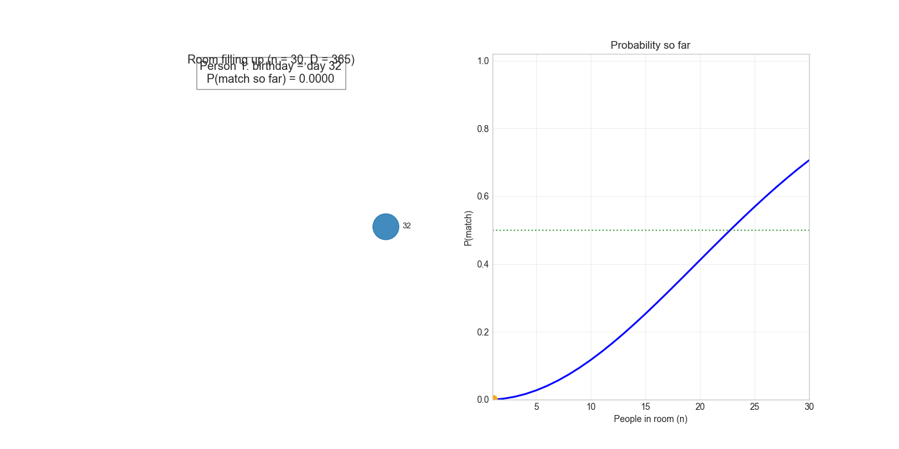
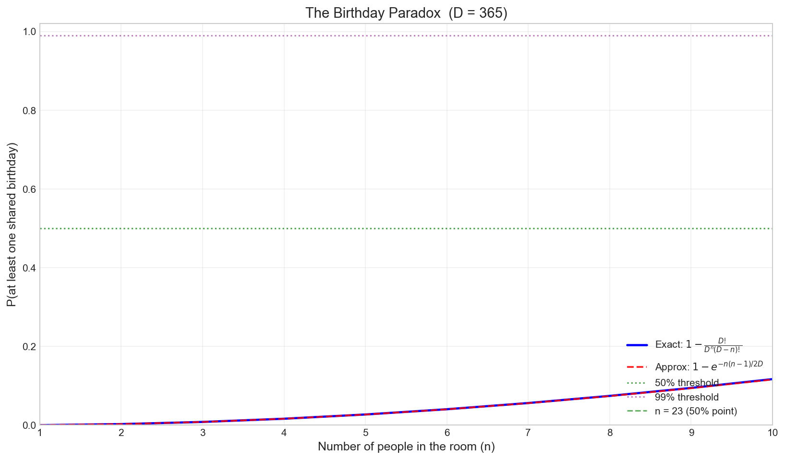
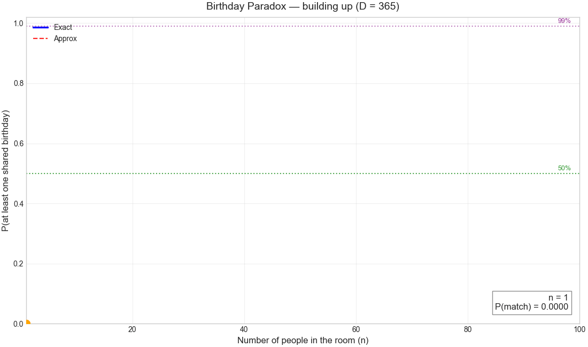
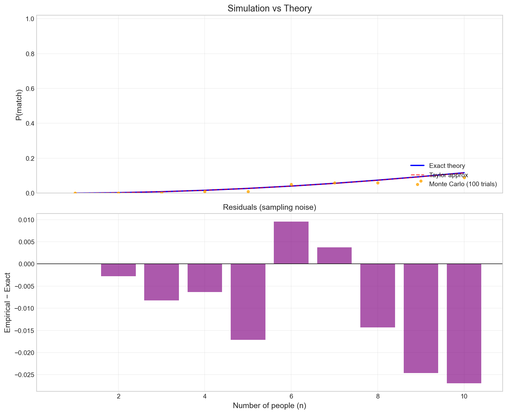
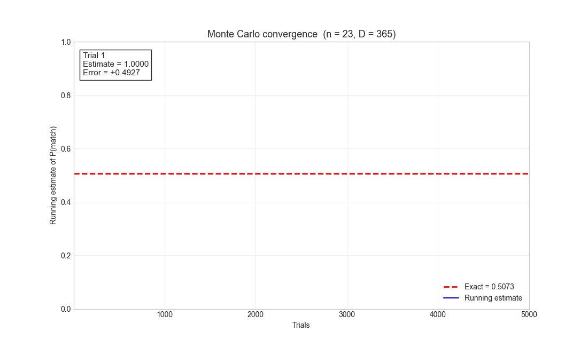
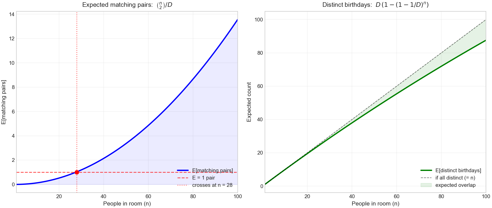
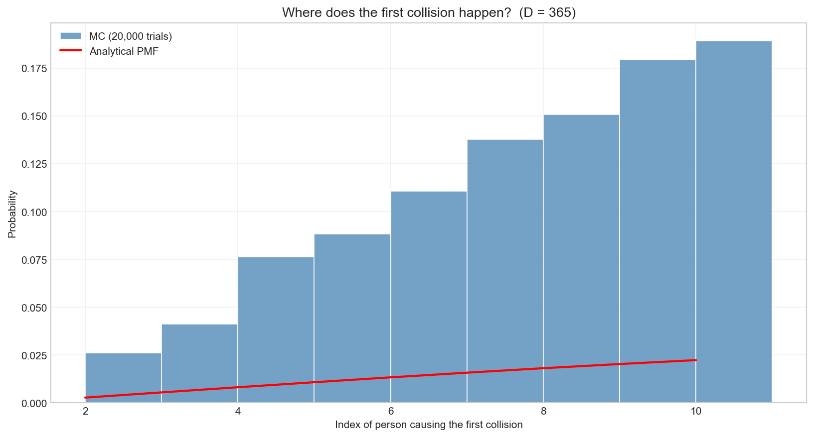
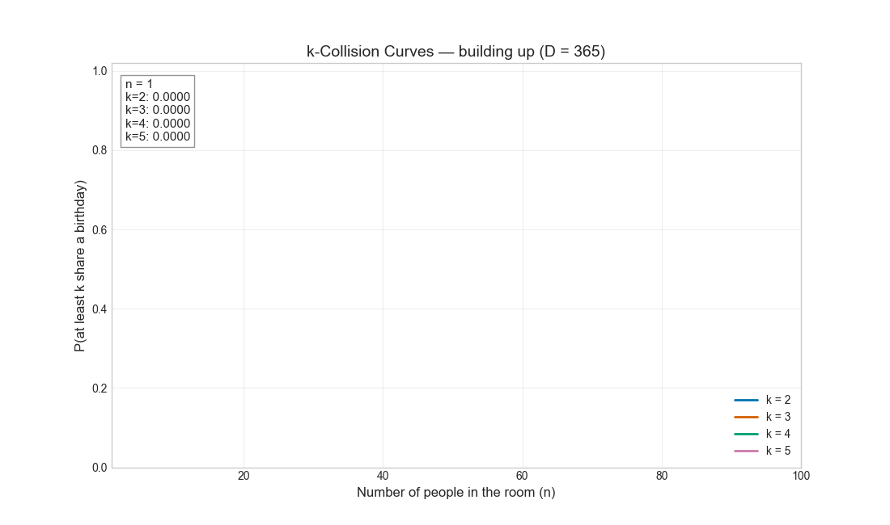

# Birthday Paradox

A probabilistic study of the **Birthday Paradox** using exact combinatorics, asymptotic approximations, and Monte Carlo simulation — with animated visualizations (v1.1).

<p align="center">
  
</p>

## Table of Contents

- [Introduction](#introduction)
- [The Model](#the-model)
- [Probability Formulas](#probability-formulas)
  - [Exact](#exact)
  - [Taylor Approximation](#taylor-approximation)
  - [Expected Collisions](#expected-collisions)
  - [Distinct Birthdays](#distinct-birthdays)
- [Results](#results)
- [Installation](#installation)
- [Usage](#usage)
- [Project Layout](#project-layout)

## Introduction

The Birthday Paradox asks: *how many people do you need in a room before two of them share a birthday with probability ≥ 50%?*

The counter-intuitive answer is **23**.

The illusion comes from comparing yourself against everyone else (~1/365 per pair). The real quantity is the number of **pairs**: 23 people produce C(23, 2) = 253 pairs, each with ~1/365 chance of matching — collisions become almost certain.

This project quantifies that intuition three ways:

1. **Exact** closed-form combinatorics
2. **Taylor approximation** with closed-form error analysis
3. **Monte Carlo** simulation for empirical verification and animations

## The Model

Each of `n` people picks a birthday uniformly at random from `D` possible days (`D = 365` by default, ignoring Feb 29 and birth-month seasonality). We ask:

> What is the probability that **at least two** people share a birthday?

**Notation:**

- `D` — pool of possible birthdays
- `n` — group size
- `T` — random variable: index of the first colliding person

## Probability Formulas

### Exact

The complement is easier: `P(all distinct)`. The first person can pick any of `D` days, the second any of `D − 1`, and so on:

```
                    D · (D-1) · (D-2) · ... · (D-n+1)        D!
P(all distinct) = ──────────────────────────────────── = ───────────────
                                D^n                      D^n · (D-n)!
```

```
P(match) = 1 − P(all distinct)
```

For numerical stability we compute it in log-space:

```
log P(no match) = lgamma(D + 1) − lgamma(D − n + 1) − n · log D
```

### Taylor Approximation

Each pair `(i, j)` has independent collision probability `1/D`. There are `C(n, 2)` pairs, so a Poisson-style approximation gives:

```
P(match) ≈ 1 − exp(−n(n−1) / (2D))
```

Setting this to `1/2` and solving:

```
n* ≈ ⌈ (1 + √(1 + 8·D·ln 2)) / 2 ⌉
```

For `D = 365`, `n* = 23`.

### Expected Collisions

Each pair matches with probability `1/D`. By linearity of expectation:

```
E[matching pairs] = C(n, 2) / D = n(n−1) / (2D)
```

For `D = 365`, this reaches `1` at `n ≈ 28`.

### Distinct Birthdays

The expected number of unique birthdays after `n` independent draws is:

```
E[distinct] = D · (1 − (1 − 1/D)^n)
```

This grows toward `D` as `n → ∞` and gives the **coupon collector** counterpart of the same model.

## Results

### Probability curve

<p align="center">
  
</p>

The exact curve and the Taylor approximation are visually identical for any practical `D`.

### Build-up animation

<p align="center">
  
</p>

[Download MP4](https://github.com/SilvioBaratto/birthday-paradox/releases/download/v1.1.0/probability_buildup.mp4)

### Simulation vs theory

<p align="center">
  
</p>

Monte Carlo agrees with the exact curve to within sampling noise (≈ `1/√trials`).

### Monte Carlo convergence

<p align="center">
  
</p>

Running estimate of `P(match)` for `n = 23` converging to the exact value `≈ 0.5073`.

[Download MP4](https://github.com/SilvioBaratto/birthday-paradox/releases/download/v1.1.0/convergence.mp4)

### Room filling animation

<p align="center">
  
</p>

[Download MP4](https://github.com/SilvioBaratto/birthday-paradox/releases/download/v1.1.0/room_filling.mp4)

### Expected pairs and distinct birthdays

<p align="center">
  
</p>

### First-collision distribution

<p align="center">
  
</p>

Distribution over the **index** of the person who first collides — analytical PMF overlaid on Monte Carlo histogram.

### k-collision animation

<p align="center">
  
</p>

Probability that at least `k` people share a birthday as group size increases.

[Download MP4](https://github.com/SilvioBaratto/birthday-paradox/releases/download/v1.1.0/k_collision_animation.mp4)

## Installation

```bash
git clone https://github.com/SilvioBaratto/birthday-paradox.git
cd birthday-paradox
python -m venv .venv && source .venv/bin/activate
pip install -e .
```

MP4 animation export uses `imageio-ffmpeg`, which bundles its own FFmpeg binary on most platforms. No separate FFmpeg install is required. If the bundled binary is unavailable on your system, install the system `ffmpeg` package and the code falls back to it automatically.

## Usage

```bash
# Closed-form analysis for n = 23
birthday analyze -n 23

# Monte Carlo for n = 23 with 100 000 trials
birthday simulate -n 23 -t 100000

# Checkpoint probability table
birthday report

# Render a single animation by name
birthday animate probability_buildup
birthday animate room_filling
birthday animate convergence
birthday animate k_collision

# Just the PNG plots (no GIFs)
birthday plot --no-animations

# Everything: plots + GIFs (takes ~20–60s)
birthday all -t 5000

# Skip MP4 generation (only GIFs)
birthday all -t 5000 --no-mp4
birthday plot -t 5000 --no-mp4
```

Custom universes:

```bash
# Smaller pool (D = 16): collisions become near-certain fast
birthday analyze -D 16 -n 6

# Generalised birthday on a 7-day "week"
birthday all -D 7 --max-people 20 -o output_week
```

## Project Layout

```
birthday-paradox/
├── src/birthday/
│   ├── core/                  # Frozen config + result dataclasses
│   ├── math/                  # Closed-form probability formulas
│   ├── simulation/            # Monte Carlo simulator
│   ├── visualization/         # Matplotlib plots + FuncAnimation GIFs + MP4s
│   │   └── writers.py         # Animation writer abstraction (Pillow + FFmpeg)
│   ├── reporting/             # Pretty-printed checkpoint tables
│   ├── di/                    # Dependency injection container
│   └── cli.py                 # Click CLI
├── tests/
├── output/                    # Generated plots and animations
├── pyproject.toml
└── requirements.txt
```

## License

MIT — see [LICENSE](LICENSE).
